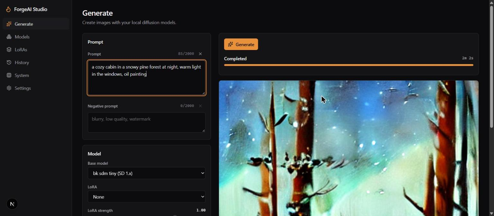
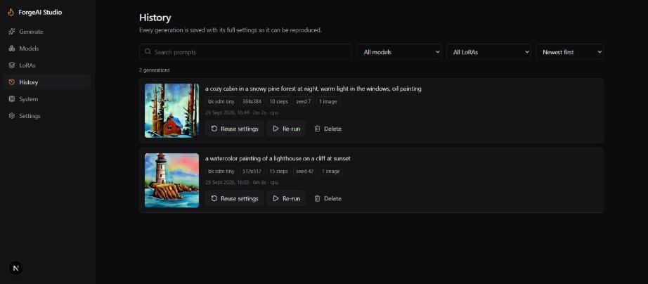
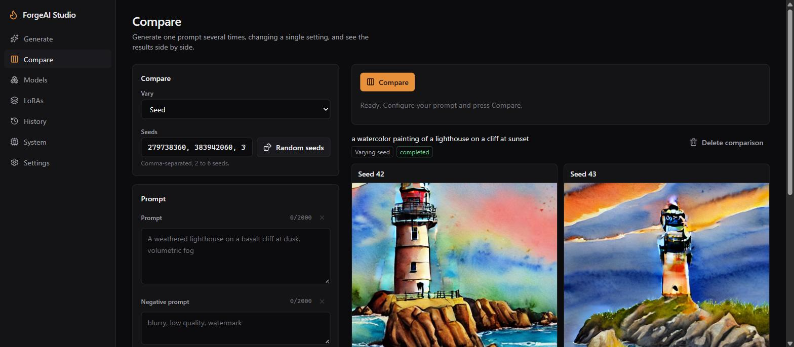
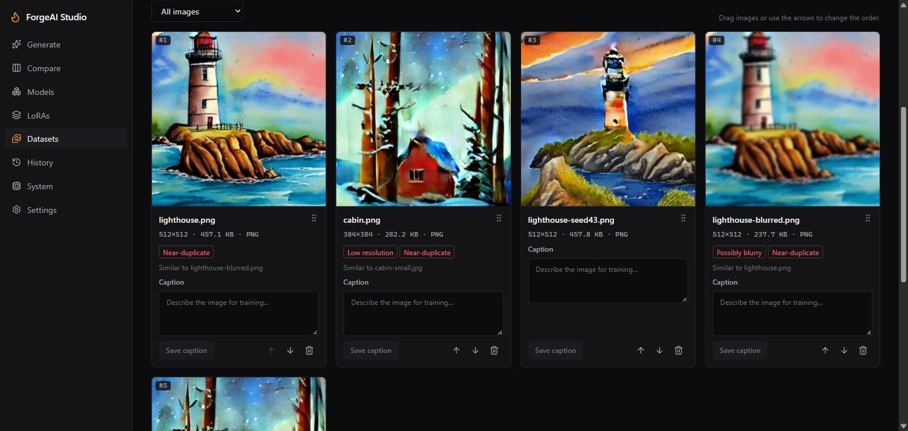
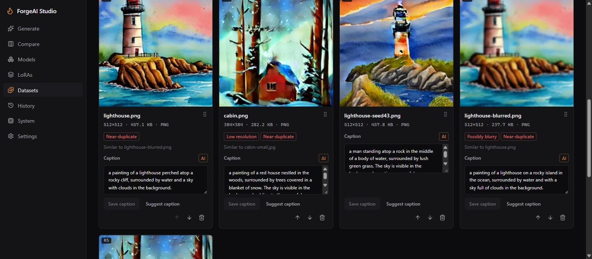
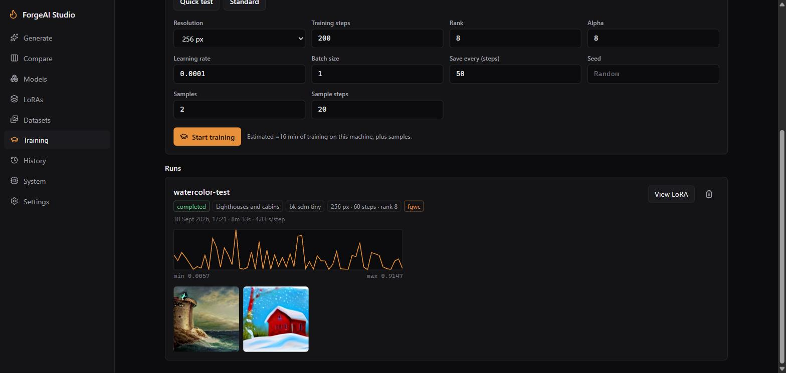
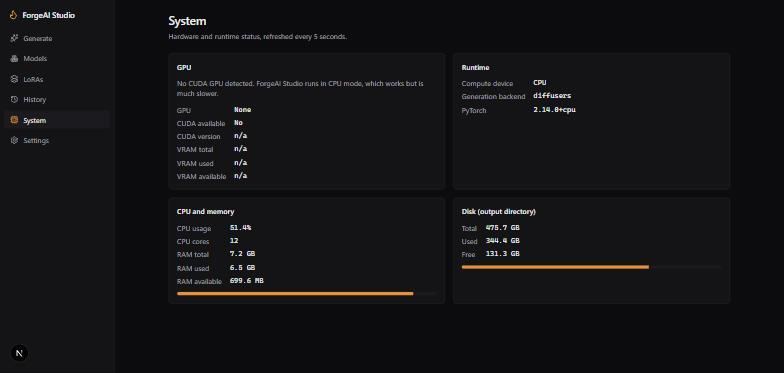
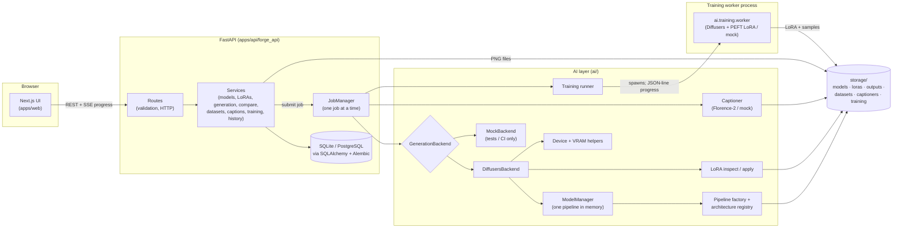

<div align="center">

# 🔥 ForgeAI Studio

**A self-hosted studio for generating images with open-source diffusion models and LoRA adapters, on your own GPU or CPU.**

[](.github/workflows/ci.yml)


</div>



> **A note on image quality and speed.** Output quality comes from the model you load, and speed
> from your hardware. The generated images in this README were made on a laptop CPU with
> [`bk-sdm-tiny`](https://huggingface.co/nota-ai/bk-sdm-tiny), a deliberately small test model
> that fits in 8 GB of RAM, so the images are not photorealistic and took minutes each. The app
> loads any Stable Diffusion 1.x or SDXL model in Diffusers or `.safetensors` format. NVIDIA GPU
> support is implemented and unit-tested but has not been run on real GPU hardware yet: see
> [GPU requirements](#gpu-requirements), [CPU mode](#cpu-mode) and
> [Known limitations](#known-limitations).

---

## Contents

- [Features](#features)
- [Screenshots](#screenshots)
- [Architecture](#architecture)
- [Tech stack](#tech-stack)
- [Installation](#installation)
- [GPU requirements](#gpu-requirements)
- [CPU mode](#cpu-mode)
- [Configuration](#configuration)
- [Running in development](#running-in-development)
- [Running tests](#running-tests)
- [Docker](#docker)
- [Using LoRAs](#using-loras)
- [Roadmap](#roadmap)
- [Known limitations](#known-limitations)
- [Security](#security)

## Features

**Generation**
- Text-to-image with Stable Diffusion 1.x and SDXL models (Diffusers folders or single-file `.safetensors` checkpoints)
- Prompt and negative prompt with character counts, width/height, steps, guidance scale, seed (with a random button) and batch size
- Live step-by-step progress over Server-Sent Events, with cancellation mid-generation
- Per-image seeds (`seed`, `seed+1`, …) so any single image from a batch can be reproduced exactly
- Results grid: download, reuse settings, copy prompt, view metadata, delete

**Models and LoRAs**
- Automatic discovery of models in a folder, with architecture detection and supported resolutions
- One model in memory at a time, explicit load/unload, automatic unload after idle time
- LoRA import with validation: `.safetensors` only, size limit, sanitised filenames, header inspection
- Base-architecture detection for LoRAs; incompatible adapters are never offered or loaded
- Enable/disable, trigger words, description and default strength per LoRA

**Comparison mode**
- One prompt, one varying setting, results side by side: e.g. `No LoRA | LoRA 0.4 | LoRA 0.8`
- Vary **LoRA strength** (with a no-LoRA baseline), **seed** or **base model**, 2 to 6 cells
- Everything else, including the seed, is shared, so differences come only from the varied setting
- All cells are validated before anything runs; finished cells appear while later ones render
- Cancelling keeps finished cells; past comparisons can be reopened or deleted
- Every cell is also a normal History entry you can reuse or download

**Dataset manager** (preparing images for future LoRA training)
- Create datasets with a target resolution (512 for SD 1.x, 1024 for SDXL)
- Upload many images at once by drag-and-drop or file picker; PNG, JPEG and WebP are decoded
  and verified, and invalid files are skipped with a reason
- Exact duplicates are skipped; near-duplicates (resized or re-saved copies) are detected with a
  perceptual hash and linked to each other
- Quality flags: low resolution, extreme aspect ratio, possibly blurry, near-duplicate. Flags are
  recomputed from the current dataset, so changing the target resolution or removing a copy
  updates them
- Per-image captions (the source and time are recorded, ready for AI captioning), resolution and
  file size, a full-size preview, filters for flagged or uncaptioned images
- Reorder by drag-and-drop or keyboard-accessible arrows; remove images; rename or delete datasets

**AI captioning** (Florence-2)
- Suggested training captions for a whole dataset or one image, as a background job with
  per-image progress; captions appear on the cards as each image finishes
- Three scopes: uncaptioned only, also refresh earlier AI captions, or every image
- Captions you wrote are never overwritten without an explicit confirmation, including edits
  made while a job is running; editing an AI caption makes it yours
- Each caption shows whether it's AI or manual and which model wrote it
- Florence's "The image shows…" opener is stripped so captions read like training captions
- Cancelling keeps finished captions; the captioner unloads when idle and never shares memory
  with the image-generation model

**LoRA training** (SD 1.x)
- Train a LoRA from a dataset: base model, trigger word, resolution, rank, alpha, learning rate,
  batch size, steps, checkpoint interval, seed, plus "Quick test" and "Standard" presets
- Runs in a separate worker process (Diffusers + PEFT), on CUDA when available or on CPU
- Live step, progress, loss (with a chart), elapsed and remaining time, and memory use;
  reloading the page reattaches to a running run
- Graceful cancel at the next step (the last checkpoint is kept); failures are shown, not hidden
- The finished LoRA is saved as `.safetensors` (with its rank and alpha) and added to the LoRA
  library with its trigger word, ready for Generate and Compare; sample images are generated
- Time estimates come from this machine's own measured pace on earlier runs

**History**
- Every generation stored with its full settings, duration, device and pipeline configuration
- Search prompts, filter by model or LoRA, sort by date, paginate, delete
- One click to **reuse settings** or **re-run** any past generation

**System**
- GPU name, VRAM, CUDA and PyTorch versions, CPU, RAM and disk usage
- Runs without an NVIDIA GPU (CPU mode)

**Engineering**
- Clean separation: thin FastAPI routes → services → framework-free `ai/` layer
- In-process job queue designed to be swapped for Redis/Celery
- SQLAlchemy 2 + Alembic migrations (SQLite by default, PostgreSQL-ready)
- Structured JSON logging, friendly error messages, no stack traces to users
- 227 backend tests (+1 opt-in real-training test), 107 frontend unit tests, 29 Playwright E2E
  tests; CI runs without a GPU

## Screenshots

| Generate | History |
| --- | --- |
|  |  |
| **Compare** | **Datasets** |
|  |  |
| **AI captions** | **Training** |
|  |  |
| **System** | |
|  | |

## Architecture



Training runs in its own process: a crash or out-of-memory error there can't take down the API,
and all of its memory is returned when it exits. The runner relays its progress to the job and
the database, then registers the finished LoRA in the library.

**Request flow for a generation**

1. `POST /api/generate` validates input (Pydantic), checks the model and LoRA are usable and compatible, resolves the seed and queues a job (`202 Accepted`).
2. The single worker thread loads the model (or reuses the loaded one), applies the LoRA, runs the Diffusers pipeline and reports each step.
3. The browser follows `GET /api/jobs/{id}/events` (SSE; falls back to polling).
4. Images are written to `storage/outputs/`, and the generation and its images are committed to the database in one transaction.

More detail: [`AGENTS.md`](AGENTS.md) (code layout and conventions) and [`docs/gpu-docker.md`](docs/gpu-docker.md).

## Tech stack

| Layer | Technology |
| --- | --- |
| Frontend | Next.js 16 (App Router), React 19, TypeScript (strict), Tailwind CSS v4, lucide-react |
| Backend | Python 3.12, FastAPI, Pydantic v2, SQLAlchemy 2, Alembic, Uvicorn |
| AI | PyTorch, Hugging Face Diffusers, Transformers, PEFT, Safetensors, Accelerate |
| Database | SQLite (default), PostgreSQL (Docker) |
| Testing | Pytest, Vitest + Testing Library, Playwright |
| Tooling | Ruff, mypy (strict), ESLint, Prettier, GitHub Actions, Docker Compose |

## Installation

Prerequisites: **Python 3.12+**, **Node.js 22+**, git. An NVIDIA GPU is optional.

```bash
git clone https://github.com/Abdullah4589/ForgeAI-Studio.git forge-ai-studio
cd forge-ai-studio
cp .env.example .env

# Backend
python -m venv .venv
# Windows: .venv\Scripts\activate    macOS/Linux: source .venv/bin/activate
pip install torch --index-url https://download.pytorch.org/whl/cpu   # or a CUDA build, see below
pip install -e ".[ai,dev]"

# Frontend
cd apps/web
npm install
```

**Get a model.** The helper downloads a small SD 1.x model (safetensors weights only, about 3.2 GB including its 1.2 GB safety checker):

```bash
python scripts/download_model.py                        # nota-ai/bk-sdm-tiny
python scripts/download_model.py stabilityai/stable-diffusion-xl-base-1.0 --name sdxl-base
```

Or copy any Diffusers model folder or `.safetensors` checkpoint into `storage/models/`.

**Get the caption model** (optional, for AI captioning; about 0.47 GB):

```bash
python scripts/download_model.py --captioner              # florence-community/Florence-2-base
```

Florence-2 is supported natively by Transformers, so no code from the model repository runs.
On a 12-thread laptop CPU it took about 11 s to load and about 8 s per image.

## GPU requirements

| Model family | Minimum VRAM (fp16) | Comfortable |
| --- | --- | --- |
| SD 1.x (512×512) | ~4 GB | 6 GB+ |
| SDXL (1024×1024) | ~8 GB with CPU offload | 12 GB+ |

- NVIDIA GPU with a recent driver. Install the PyTorch build matching your CUDA version from
  <https://pytorch.org/get-started/locally/>, e.g. `pip install torch --index-url https://download.pytorch.org/whl/cu124`.
- On CUDA, weights load in fp16 and attention slicing, VAE slicing and PyTorch SDPA keep memory down.
- Low on VRAM? Set `ENABLE_CPU_OFFLOAD=true`. Out-of-memory errors return a friendly message
  suggesting a smaller resolution, fewer images, CPU offload or a lighter model.
- AMD and Apple GPUs are not supported yet; they fall back to CPU mode.
- No NVIDIA GPU? Run the API on a rented cloud GPU and keep the web UI on your machine:
  [docs/cloud-gpu.md](docs/cloud-gpu.md).

## CPU mode

With no CUDA device (or `DEVICE=cpu`) ForgeAI Studio runs everything on the CPU in fp32. It works,
but it is slow: on a 12-thread laptop CPU with 8 GB RAM, the bundled `bk-sdm-tiny` model took
about 1 minute to load and about 6 minutes for 15 steps at 512×512 (about 2 minutes for 10 steps
at 384×384). Tips: use small distilled
models, fewer steps and one image at a time, and close other memory-hungry apps.

## Configuration

All settings are environment variables (or a `.env` file in the repo root). See [`.env.example`](.env.example).

| Variable | Default | Description |
| --- | --- | --- |
| `DATABASE_URL` | `sqlite:///./storage/forge.db` | SQLAlchemy URL; `postgresql+psycopg://…` for Postgres (install `.[postgres]`) |
| `MODEL_DIRECTORY` | `./storage/models` | Where base models are discovered |
| `LORA_DIRECTORY` | `./storage/loras` | Where LoRAs are stored and discovered |
| `OUTPUT_DIRECTORY` | `./storage/outputs` | Generated PNGs |
| `DATASET_DIRECTORY` | `./storage/datasets` | Dataset images and thumbnails |
| `CAPTION_BACKEND` | `florence` | `florence` (real) or `mock` (tests/CI only) |
| `CAPTION_MODEL_DIRECTORY` | `./storage/captioners/florence-2-base` | Florence-2 model folder |
| `TRAINING_BACKEND` | `diffusers` | `diffusers` (real, worker process) or `mock` (tests/CI only) |
| `TRAINING_DIRECTORY` | `./storage/training` | Per-run config, worker log, checkpoints, samples |
| `DEVICE` | `auto` | `auto`, `cuda` or `cpu` (falls back to CPU if CUDA is missing) |
| `GENERATION_BACKEND` | `diffusers` | `diffusers` (real) or `mock` (tests/CI only) |
| `ENABLE_CPU_OFFLOAD` | `false` | Model CPU offload on CUDA (lower VRAM, slower) |
| `MODEL_IDLE_UNLOAD_SECONDS` | `600` | Unload the model after this idle time (`0` = never) |
| `MAX_UPLOAD_SIZE_MB` | `1024` | LoRA upload limit |
| `MAX_IMAGE_UPLOAD_MB` | `25` | Per-file limit for dataset images |
| `LOG_LEVEL` | `INFO` | Python log level (JSON logs) |
| `CORS_ORIGINS` | `http://localhost:3000` | Comma-separated browser origins allowed to call the API |
| `NEXT_PUBLIC_API_URL` | `http://localhost:8000` | API URL used by the browser (frontend) |

Default generation parameters (size, steps, guidance, negative prompt, count) are editable in the
**Settings** page and stored in the database.

## Running in development

Two terminals:

```bash
# 1. API (repo root, venv active). Applies migrations on startup.
uvicorn forge_api.main:app --app-dir apps/api --reload --port 8000

# 2. Web UI
cd apps/web
npm run dev
```

Open <http://localhost:3000>. API docs are at <http://localhost:8000/docs>.

No model yet, or just working on the UI? Run the API with `GENERATION_BACKEND=mock`. It produces
deterministic placeholder gradients instead of real images, which exercises every workflow without
downloading weights.

## Running tests

```bash
# Backend: lint, types, unit and integration tests (no GPU or model needed)
ruff check . && ruff format --check . && mypy && pytest

# Frontend
cd apps/web
npm run lint && npm run typecheck && npm run format:check
npm test                 # Vitest unit/component tests
npx playwright install chromium
npx playwright test      # E2E; starts the API in mock mode and the web app for you
```

Optional, local only: a real 2-step LoRA training run (needs the `[ai]` extra and
`bk-sdm-tiny`; about 1–2 minutes on CPU; skipped otherwise):

```bash
FORGE_REAL_TRAINING=1 pytest tests/integration/test_training_real.py
```

The Playwright suite (`apps/web/e2e/`) covers: app load and navigation, model selection, prompt
entry, generation with progress and results, metadata and download, validation errors,
cancellation, history search/filter, reuse settings from history and from a result, LoRA import
(valid and invalid) and use, the System page and saved defaults. For comparison mode it covers
LoRA strengths with a no-LoRA baseline, seeds, models, validation errors, cells appearing while
the comparison runs, cancelling (finished cells kept), and reopening and deleting comparisons.
For datasets it covers uploads (with duplicates and invalid files skipped), captions, reordering
by arrows and drag-and-drop, preview, removal, every quality flag and filter, and renaming and
deleting datasets. Dataset test images are generated with a small PNG encoder
(`apps/web/e2e/images.ts`). For AI captioning (with the mock captioner) it covers captioning
uncaptioned images while keeping manual ones, the confirmation before replacing manual
captions, single-image suggestions, captions appearing while the job runs, and cancelling.
For training (with the mock trainer running in a real worker process) it covers a full run
through to using the new LoRA on the Generate page, form validation, a failing run, cancelling,
and reattaching to a running run after a page reload.

## Docker

```bash
docker compose up --build          # PostgreSQL + API (CPU) + web UI
```

- Web UI: <http://localhost:3000>, API: <http://localhost:8000>
- `./storage/{models,loras,outputs}` are mounted into the API container.
- NVIDIA GPUs: `docker compose -f docker-compose.yml -f docker-compose.gpu.yml up --build`,
  see [docs/gpu-docker.md](docs/gpu-docker.md).

Docker is optional; everything also runs natively (see above).

## Using LoRAs

1. Open **LoRAs** → choose a `.safetensors` file → **Import**. You can also drop files into
   `storage/loras/` and press **Rescan**.
2. ForgeAI Studio reads only the file header to confirm it is a LoRA and detect its base
   architecture (SD 1.x via 768-wide cross-attention, SDXL via 2048-wide / second text encoder).
3. Add trigger words, a description and a default strength. Disable LoRAs you don't want offered.
4. On **Generate**, pick a base model: the LoRA list shows only compatible, enabled adapters. The
   strength slider ranges from -2 to 2.
5. The adapter is attached for that generation only and removed afterwards, so it never leaks into
   the next one.

Adapters whose architecture can't be determined are allowed, and a failed load is reported as
"incompatible" rather than crashing.

## Roadmap

- [x] **Phase 1 - MVP:** generation, model and LoRA management, history, system page, tests, Docker, CI
- [x] **Phase 2 - Comparison mode:** one prompt across LoRA strengths, seeds and models, side by side
- [x] **Phase 3 - Dataset manager:** upload, caption, dedupe and quality-check training images
- [x] **Phase 4 - AI captioning:** vision-language captions with manual review
- [x] **Phase 5 - LoRA training:** configurable training with live loss, cancellation and samples

## Known limitations

- Only SD 1.x and SDXL text-to-image pipelines; no img2img, inpainting or ControlNet yet.
- One model in memory and one job (generation or comparison) at a time, by design for consumer
  hardware; a second request while one is running gets `409 Conflict`.
- Comparisons vary one setting at a time (no grids such as strength × seed yet). Comparing models
  loads each model in turn, which is slow on CPU.
- SD 1.x models may include an NSFW safety checker, which can false-positive, especially at low
  step counts. Flagged images are marked and shown as "Blocked by the safety checker" rather than
  as unexplained black squares. The checker itself can't be turned off from the app. Images
  generated before this was added aren't marked.
- LoRA training supports SD 1.x only (no SDXL, no text-encoder training, no resuming from a
  checkpoint yet). It is slow on CPU: with the tiny `bk-sdm-tiny` model on a 12-thread laptop, a
  step took about 3.4–4.8 s at 256 px and about 13 s at 512 px, so a 512 px run of 800 steps takes
  roughly 3 hours. Per-step loss is noisy by nature; read the trend. Nothing else (generation,
  captioning) can run while training.
- AI captions are suggestions and can be wrong: in testing, Florence-2 described a stylised
  lighthouse as "a man standing atop a rock". Review captions before training. Only Florence-2
  is wired up so far; the captioner interface allows adding others (e.g. SmolVLM, which needs
  `torchvision`).
- Dataset quality checks are heuristics: "possibly blurry" measures edge strength and can
  misjudge deliberately soft or minimalist images. Datasets hold up to 1,000 images, uploads are
  limited to 50 files per request (the UI batches larger drops), and there's no export yet.
- AMD (ROCm/DirectML) and Apple Silicon (MPS) acceleration are not wired up; they use CPU mode.
- The job queue is in-process: jobs are lost if the API restarts, and it doesn't scale across
  workers yet.
- Model and LoRA preview images are stored as metadata fields, but there is no UI to set them yet.
- The CUDA paths (fp16, CPU offload, OOM handling) are unit-tested with fakes. Real generation was
  verified on CPU only; CI has no GPU.
- The GPU Docker override is documented but not verified on NVIDIA hardware.
- No authentication: run it on a trusted machine or network only.

## Security

- **No remote code.** The caption model uses Transformers' built-in Florence-2 class, never
  `trust_remote_code`, and the download script skips any `.py` files in model repositories.
- **No pickle loading.** Models load with `use_safetensors=True`; LoRAs must be `.safetensors`.
  LoRA validation parses only the JSON header, with a size cap, and never executes file content.
- **Uploads are untrusted:** extension allow-list, streaming size limit, sanitised filenames,
  resolved-path checks that block traversal, and a temp-file then atomic-rename flow, so partial or
  invalid uploads never appear.
- **Dataset images** are identified by decoding their content, not by extension or MIME type.
  Images claiming more than 50 megapixels are rejected from the header alone (decompression-bomb
  protection), and files are stored under random names, never under the uploaded filename.
- **Files are served by database id**, never by client-supplied paths.
- **Input validation** on every request (Pydantic, `extra="forbid"`), and SQL only through
  SQLAlchemy with bound parameters, including escaped `LIKE` search.
- **Errors:** users see friendly messages; stack traces go only to the server logs. Prompts are
  truncated in logs, and no secrets are logged.
- **Configuration** comes from environment variables. `.env` files are git-ignored, and the Docker
  Postgres password is a local-development default you should override.
- **No authentication yet:** don't expose the API to the internet.

## License

© 2026 Abdullah. All rights reserved. The source is public for review; no open-source licence has
been granted. Models you download keep their own licences.
